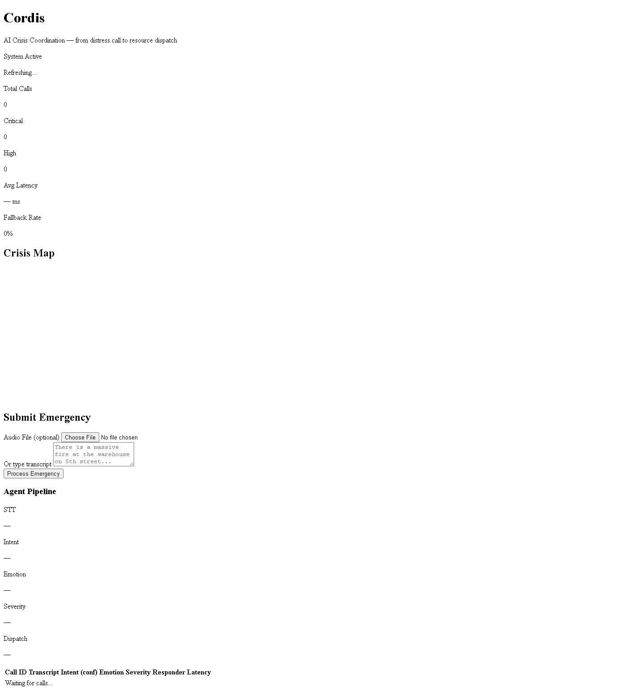
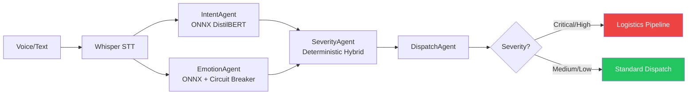
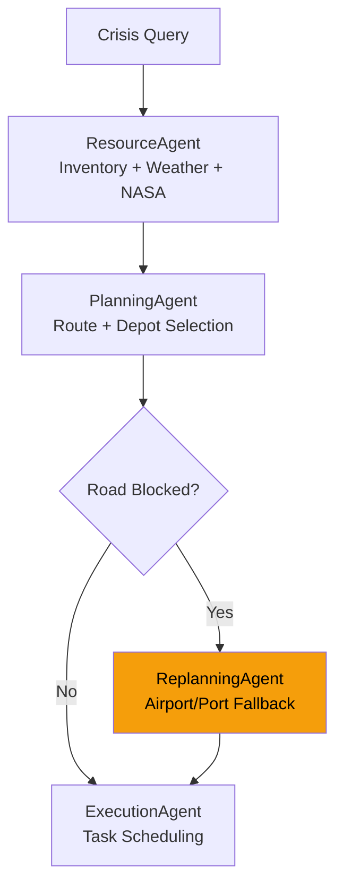

<div align="center">

# Cordis

**Open-source AI crisis coordination — from distress call to resource dispatch in under 60ms.**

[](https://github.com/mangod12/cordis/actions)
[](backend/tests/)
[](backend/tests/)
[](https://python.org)
[](LICENSE)
[](docker-compose.yml)

[Features](#what-it-does) · [Quick Start](#quick-start) · [Architecture](#architecture) · [API](#api) · [Contributing](#contributing)

</div>

---

> **Decision-support tool for crisis coordination.** Not a replacement for 911/CAD systems. See [DISCLAIMER.md](DISCLAIMER.md).

## What Makes Cordis Different

| Feature | Cordis | Ushahidi | Resgrid | Netflix Dispatch |
|---------|--------|----------|---------|------------------|
| AI triage (voice/text → severity) | Yes (local ML) | No | No | No |
| Multi-agent logistics | Yes (4-agent pipeline) | No | No | No |
| Works offline (zero API cost) | Yes | Partial | No | No |
| Real geographic data | 21 airports, 13 ports | Crowdsourced | No | No |
| Hindi/multilingual keywords | Yes (99 languages via Whisper) | SMS only | No | No |
| Open source | Apache 2.0 | AGPL | Apache 2.0 | Apache 2.0 |
| Crisis types | 16+ (flood, cyclone, earthquake...) | User-defined | Fire/EMS/SAR | IT incidents |

## Try It in 60 Seconds

```bash
# Clone and start
git clone https://github.com/mangod12/cordis.git && cd cordis
docker compose up

# In another terminal — simulate a fire emergency
make demo-fire

# Or run all 5 demo scenarios
make demo-all
```

<details>
<summary>Without Docker (local Python)</summary>

```bash
cd backend
python -m venv .venv && source .venv/bin/activate
pip install -r requirements.txt
cp .env.example .env  # Set SECRET_KEY
uvicorn app.main:app --port 8000
```

</details>

## Dashboard



Real-time crisis coordination dashboard with:
- **Leaflet map** — crisis locations with severity-colored markers
- **Voice/text input** — submit emergencies directly from the UI
- **Agent pipeline visualization** — watch STT → Intent → Emotion → Severity → Dispatch in real-time
- **Live call table** — all processed emergencies with latency tracking

## What It Does

### Emergency Triage Pipeline



| Agent | What It Does | How |
|-------|-------------|-----|
| **Whisper STT** | Transcribes voice to text | Local model, 99 languages, zero API cost |
| **IntentAgent** | Classifies emergency type | ONNX DistilBERT — medical, fire, accident, gas, crime, mental health |
| **EmotionAgent** | Detects caller distress | ONNX model — 7 emotions, circuit breaker fallback |
| **SeverityAgent** | Scores urgency 0-1 | `0.5*intent + 0.25*keywords + 0.15*emotion + 0.1*reasoning` |
| **DispatchAgent** | Routes to responder | ambulance, fire, police, hazmat, search_rescue |

### Logistics Coordination Pipeline



| Agent | Data Sources |
|-------|-------------|
| **ResourceAgent** | Warehouse inventory, Open-Meteo weather, NASA EONET disasters |
| **PlanningAgent** | Depot selection, Haversine ETAs, cost comparison |
| **ReplanningAgent** | 21 airports, 13 ports, alternative road routes |
| **ExecutionAgent** | Subtask creation, delivery scheduling, truck allocation |

All agents have **deterministic fallbacks** — the system produces realistic plans even without Gemini.

## API

| Method | Endpoint | Description |
|--------|----------|-------------|
| `POST` | `/process-emergency` | Full triage — audio file or text transcript |
| `POST` | `/api/v1/logistics/execute` | Run logistics pipeline for a crisis scenario |
| `GET` | `/api/v1/logistics/tasks/{id}` | Task with plan, schedule, and reasoning |
| `GET` | `/api/v1/logistics/tasks/{id}/logs` | Agent execution logs |
| `POST` | `/api/v1/auth/login` | JWT authentication |
| `GET` | `/api/v1/calls/live` | Live dashboard feed |
| `WS` | `/ws/calls/{call_id}` | Real-time call event stream |
| `GET` | `/health` | Health check |
| `GET` | `/metrics` | Prometheus metrics |
| `GET` | `/docs` | Swagger UI (dev mode) |

## Architecture

```
backend/
├── app/
│   ├── agents/                    # AI agent implementations
│   │   ├── intent/                #   ONNX DistilBERT classification
│   │   ├── emotion/               #   ONNX emotion + circuit breaker
│   │   ├── severity/              #   Deterministic hybrid scoring
│   │   ├── dispatch/              #   Responder routing
│   │   ├── stt/                   #   Whisper speech-to-text
│   │   └── logistics/             #   Gemini multi-agent pipeline
│   │       ├── orchestrator.py    #     Central coordinator
│   │       ├── resource.py        #     Inventory + weather + NASA feeds
│   │       ├── planner.py         #     Route planning + dispatch
│   │       ├── replanning.py      #     Crisis rerouting
│   │       └── execution.py       #     Task scheduling
│   ├── api/v1/endpoints/          # REST API
│   ├── services/                  # Business logic
│   │   ├── logistics/tools/       #   Weather, routes, disaster feeds
│   │   ├── logistics/llm/         #   Gemini client
│   │   ├── logistics/memory/      #   pgvector agent memory
│   │   └── pipeline_connector.py  #   Triage → Logistics bridge
│   ├── models/                    # SQLAlchemy ORM
│   ├── core/                      # Config, auth, database
│   └── main.py                    # FastAPI entry point
├── tests/
│   ├── scenarios/                 # 16 golden test scenarios
│   ├── e2e/                       # Playwright browser tests
│   └── test_*.py                  # 242 tests total
└── requirements.txt
```

## Tech Stack

| Layer | Technology |
|-------|-----------|
| **Framework** | FastAPI + async SQLAlchemy |
| **Triage ML** | Whisper (local STT), ONNX Runtime (intent + emotion) |
| **Logistics LLM** | Google Gemini 2.5 Flash via function calling |
| **Database** | PostgreSQL + pgvector (SQLite for dev) |
| **Cache** | Redis (pub/sub, caching, live dashboard) |
| **Real-time** | WebSockets + Redis pub/sub |
| **External Data** | Open-Meteo, NASA EONET, OpenRouteService |
| **Auth** | JWT (HS256) + rate limiting + tenant isolation |
| **Observability** | structlog (JSON), Prometheus metrics |
| **Protocol** | MCP (Model Context Protocol) |
| **Testing** | pytest + Playwright (242 tests) |
| **CI/CD** | GitHub Actions (lint, test, coverage, Docker) |

## Configuration

| Variable | Required | Default | Description |
|----------|----------|---------|-------------|
| `SECRET_KEY` | Yes | — | JWT signing key |
| `USE_SQLITE` | No | `true` | SQLite for dev, PostgreSQL for production |
| `GEMINI_API_KEY` | No | — | Enables LLM logistics (works without via fallbacks) |
| `LOGISTICS_ENABLED` | No | `true` | Toggle logistics pipeline |
| `WHISPER_MODEL_SIZE` | No | `small` | tiny \| base \| small \| medium \| large |
| `REDIS_URL` | No | `redis://localhost:6379` | Redis connection |

## Offline / Zero-Cost Mode

Cordis runs without any paid APIs:

- **Whisper** — local model, no OpenAI API
- **Intent + Emotion** — local ONNX models, no cloud ML
- **Logistics** — deterministic fallbacks without Gemini
- **Weather** — Open-Meteo (free, no key)
- **Disasters** — NASA EONET (free, no key)
- **Routes** — OpenRouteService (free tier: 2000 req/day)

## Real Geographic Data

| Data | Count | Source |
|------|-------|--------|
| Airports | 21 (incl. IAF bases) | Static + coordinates |
| Ports | 13 major | Static + capacity data |
| Cities | 100+ Indian cities/states | Coordinate lookup |
| Weather | Live | Open-Meteo API |
| Disasters | Live | NASA EONET |
| Routes | Live | OpenRouteService |

## Testing

```bash
make test          # 184 unit/integration tests
make test-cov      # With coverage report
make lint          # Ruff linter

# Playwright e2e (requires running server)
pytest tests/e2e/ -v

# Demo scenarios
make demo-fire     # Critical warehouse fire
make demo-flood    # Flood logistics coordination
make demo-medical  # Cardiac arrest triage
make demo-all      # All 5 scenarios
```

| Test Category | Count | Coverage |
|--------------|-------|---------|
| Severity engine | 25 | Thresholds, hybrid formula, critical floor |
| Dispatch routing | 12 | All intent types, hazmat, search_rescue |
| Pipeline connector | 15 | Trigger gating, query building |
| Golden scenarios | 32 | 16 disaster types incl. India-specific |
| Adversarial | 14 | Prompt injection, SQL injection, edge cases |
| Contract tests | 12 | Schema validation, geodata coverage |
| API schemas | 8 | Request/response models |
| Load tests | 3 | Concurrency, throughput, determinism |
| Hindi keywords | 7 | Multilingual severity detection |
| E2E (Playwright) | 18 | Dashboard, map, inputs, responsive |
| **Total** | **202** | |

## Contributing

This project helps people in crisis — every improvement matters.

```bash
make setup         # Install dependencies
make test          # Run tests
make lint          # Check code style
```

See [CONTRIBUTING.md](CONTRIBUTING.md) for guidelines and [ROADMAP.md](docs/ROADMAP.md) for planned features.

### Good First Issues

- Add more crisis keywords to the severity engine
- Add more Indian cities to the coordinate lookup
- Write tests for untested logistics pipeline components
- Improve error messages in the logistics API
- Add more golden test scenarios for different disaster types

## History

Cordis began as two separate projects:

- **Redline-AI** — AI-powered emergency triage (voice → intent → severity → dispatch)
- **TaskForge** — multi-agent logistics coordination for crisis supply chains

Merged in May 2026 into **Cordis** — Latin for "heart."

## License

Apache License 2.0 — free to use, modify, and distribute. See [LICENSE](LICENSE).

---

<div align="center">

**If this project helps you, consider giving it a star.**

It helps others discover tools that could make a difference during a crisis.

</div>
